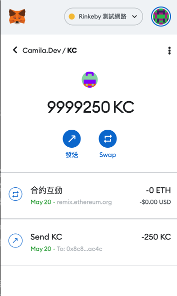

# Homework Week 2

## ERC20

+ 合約位置: ./contracts/KnotCoin.sol
+ 發行Knot Coin, 總量10,000,000個

+ JavaScript VM（London）
    - 傳送指定數量給指定地址，交易成功的截圖。
      

+  Injected Web3（Metamask）
    - 發行合約地址合約地址 [0x311A9CE2bF897179B1bA7382ce2bB82779a2Be38](https://rinkeby.etherscan.io/address/0x311A9CE2bF897179B1bA7382ce2bB82779a2Be38)
    
    - Import小狐狸錢包
     

    - 傳送 **250 KC** to 指定地址: **0x8c86618D194627172101812b51B4b9bB794DAC4c** ([Transaction Details](https://rinkeby.etherscan.io/tx/0x9dedb37f27f864d930e3e26220128c5f019cb010c528794ca5064cc59b0df4a3)) 
     

    - 燃燒 500 KC ([Transaction Details](https://rinkeby.etherscan.io/tx/0x5a69a6768714add4c22e6ae3bc7c499ce85d51c3428b7e3d84cbb93b090cba7f))

---

## ERC721

+ 合約位置: ./contracts/KnotNFT.sol
+ 發行Knot NFT
+ JavaScript VM（London）
    - 傳送2個ERC721給指定地址交易截圖
      

+  Injected Web3（Metamask）
    - 發行合約地址合約地址 [0x3c5f78f5836A2bbB046cf6d7254fEFb52cEb8aD3](https://rinkeby.etherscan.io/tx/0x5a69a6768714add4c22e6ae3bc7c499ce85d51c3428b7e3d84cbb93b090cba7f)
    - 鑄造5個NFT [Transaction Details](https://rinkeby.etherscan.io/tx/0xa05d7173e81509731ebf268ef80651b27c7d5517c0e4ab0671df1062d4327a8b)
    - 發送一個NFT給指定地址 [Transaction Details](https://rinkeby.etherscan.io/tx/0x0e142782419dc17c34df03fa14dcb40398c5444eb60c733bd798bee8bff86a3e) **0x8c86618D194627172101812b51B4b9bB794DAC4c** 
    - 燃燒一個ERC721 [Transaction Details](https://rinkeby.etherscan.io/tx/0x32a7735eb0a56c574813fd18e704a35913af2bf5d7e9839fb773d3adc7f88616)
